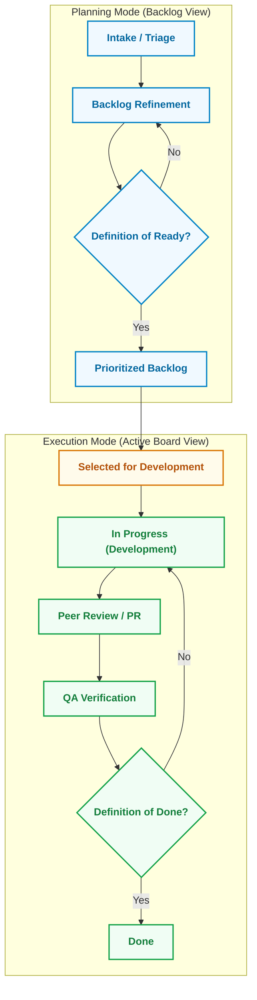

# Designing a Kanplan-Based Software Development Life Cycle (SDLC)

## 1. What is Kanplan?
**Kanplan** is a hybrid Agile framework that introduces a Scrum-style backlog screen to a Kanban board. It combines the structured prioritization and backlog grooming of Scrum with the continuous flow and pull system of Kanban.

* **The Problem It Solves**: In traditional Kanban, unstarted work is placed in the first column (e.g., "To Do"). As the backlog grows, this column becomes a cluttered "wasteland," making it extremely difficult for Product Owners to prioritize, groom, and map work items to Epics or Versions. Kanplan solves this by dividing the workspace into two distinct views:
  1. **Planning Mode (Backlog view)**: A list-based screen dedicated to backlog grooming, epic planning, and version management, isolated from the daily development view.
  2. **Execution Mode (Kanban board view)**: A visual board mapping the active workflow columns with Work-in-Progress (WIP) limits where developers pull work.

### Comparison Matrix
| Feature | Scrum | Kanban | Scrumban | Kanplan |
| :--- | :--- | :--- | :--- | :--- |
| **Workflow** | Iterative (Fixed Sprints) | Continuous Flow | Continuous Flow | Continuous Flow |
| **Planning Cadence** | Timeboxed (Sprint Planning) | On-demand / Continuous | Iterative or On-demand | Continuous (Backlog Grooming) |
| **Backlog Screen** | Dedicated Backlog | None (Everything on Board) | Dedicated Backlog | Dedicated Backlog |
| **Timeboxes** | Strict Sprints (1-4 weeks) | None | Optional / Sprints | None |
| **Commitment** | Sprint Backlog commitment | Capacity-based (WIP limits) | Capacity-based (WIP limits) | Capacity-based (WIP limits) |
| **Roles** | Product Owner, Scrum Master, Dev Team | No specific roles defined | Scrum roles are optional | Product Owner, Agile Coach, Dev Team |

---

## 2. Kanplan SDLC Workflow Phases
A Kanplan-based SDLC consists of two distinct modes that bridge the gap between product management and engineering execution:

### Phase A: Backlog Management (Planning Mode)
1. **Intake & Triage**: Incoming requests, bugs, and ideas are logged directly into the bottom of the Backlog.
2. **Backlog Refinement (Grooming)**:
   - The Product Owner (PO) and engineering representatives refine raw user stories.
   - Tasks are estimated (story points or T-shirt sizes) to ensure they are appropriately sized (no single task should be too large to block the flow).
   - Tasks are linked to **Epics** (macro features) and **Versions** (releases).
3. **Definition of Ready (DoR)**: A story cannot move to the active board unless it meets the DoR:
   - Clear user story description (As a... I want... So that...).
   - Well-defined Acceptance Criteria (Gherkin style: Given/When/Then preferred).
   - Necessary designs/mockups attached.
   - External dependencies resolved.
   - Technical estimate completed.
4. **Prioritization**: The PO continuously orders the backlog list, keeping the most valuable, ready-to-work items at the top.

### Phase B: Transition (The Commitment Point)
1. **Selected for Development**: The PO drags ready items from the top of the Backlog into the **Selected for Development** column.
2. **The Pull Signal**: Once an item enters this column, it becomes visible on the active Kanban board, signaling to the development team that it is authorized and ready to be pulled into execution.

### Phase C: Execution (Execution Mode / Active Board)
1. **Development (In Progress)**: Developers pull items from the top of the "Selected for Development" column when their capacity allows.
2. **Code Review & Peer Feedback**: Once coding is complete, the item is moved to "Peer Review" or "Pull Request" status.
3. **Quality Assurance (Testing)**: The item is deployed to a staging environment and tested against the Acceptance Criteria.
4. **Definition of Done (DoD)**: A card is moved to "Done" only when it meets the DoD:
   - Code peer-reviewed and merged to the main branch.
   - Automated tests pass (unit, integration).
   - QA verification complete.
   - Documentation updated.
   - Deployed to the target release branch/environment.

---

## 3. Backlog Management Best Practices
* **Zero Wasteland Principle**: Keep the active Kanban board uncluttered. Any task that is not actively being worked on or immediately selected for development must reside in the backlog list screen.
* **Continuous Grooming**: Schedule a weekly or bi-weekly grooming cadence to keep the top 1.5 to 2 weeks of development capacity fully refined and ready (meeting the DoR).
* **Backlog Slicing**: Ensure user stories are sliced vertically (delivering end-to-end value) rather than horizontally (database only, frontend only) to maintain a smooth flow of deployable features.
* **Use of Release Versions**: Because there are no sprints, track progress by grouping items into release versions. Release whenever a set of features is done (Continuous Delivery) or at set calendar cadences.

---

## 4. Work-in-Progress (WIP) Limits
WIP limits are the engine of Kanban and Kanplan. They prevent multitasking, minimize context switching, and surface bottlenecks.
* **How to Design WIP Limits**:
  * **By Column**: Set limits on active states (e.g., In Progress, Review, QA). Do not set limits on "Done" or the "Backlog" screen.
  * **Formulas**:
    * **In Progress WIP**: `Number of Developers * 1` or `Number of Developers * 1.5`. (Lower is better to encourage swarming and pairing).
    * **Peer Review WIP**: `Number of Developers / 2` (encourages developers to review code quickly rather than letting PRs stack up).
    * **QA WIP**: `Number of QA Engineers * 1.5`.
* **Managing WIP Violations**:
  * If a WIP limit is exceeded (e.g., QA is full), the column is flagged (visual alert/red banner in Jira).
  * **Rule**: No new work can be pulled from the left. Developers must "swarm" to help the bottlenecked stage to the right (e.g., help QA test, review open PRs) before starting new coding tasks. "Stop starting, start finishing."

---

## 5. Metrics & Analytics
Since Kanplan does not use sprint velocity, team performance and predictability are measured using flow-based metrics:
* **Cycle Time**:
  * **Definition**: The time elapsed from when an item enters the active board (e.g., "In Progress") until it enters the "Done" state.
  * **Goal**: Minimize cycle time. A lower cycle time indicates a highly efficient development process and faster time-to-market.
* **Lead Time**:
  * **Definition**: The time elapsed from when a request is created in the backlog until it reaches "Done".
  * **Goal**: Measure customer responsiveness. The gap between Lead Time and Cycle Time reveals how long ideas wait in the backlog before being worked on.
* **Throughput**:
  * **Definition**: The number of work items completed per unit of time (e.g., stories completed per week).
  * **Goal**: Use historical throughput to forecast future release timelines (using Monte Carlo simulations) rather than using subjective commitments.
* **Cumulative Flow Diagram (CFD)**:
  * A stacked area chart showing the count of tasks in each workflow state over time.
  * **How to Read**:
    * **Band Thickness**: Represents the WIP in that stage. If a band widens, it indicates a bottleneck.
    * **Slope of Done**: Represents throughput.
    * **Horizontal Distance**: Represents the average cycle time.
* **Control Chart**:
  * Plots the cycle time of individual issues over time.
  * Helps identify process variability. Outliers (issues with extremely high cycle times) should be investigated in retrospectives.

---

## 6. Team Organization and Cadences
Organizing a Kanplan team requires shifting focus from "sprint commitment" to "flow optimization."
* **Roles**:
  * **Product Owner**: Owns the backlog screen. Prioritizes, refines, and moves items to the active board's starting column.
  * **Development Team**: Self-organizes, pulls work, adheres to WIP limits, and ensures the Definition of Done is met.
  * **Agile Coach / Delivery Lead**: Focuses on workflow health, monitors WIP limits, facilitates cadences, and analyzes flow metrics to remove systemic blockers.
* **Meeting Cadences**:
  * **Daily Standup (15 mins)**:
    * Shift focus from "What did I do yesterday?" to "How do we move cards across the board?"
    * Walk the board from right to left (focusing on items closest to Done first) to unblock items and optimize flow.
  * **Backlog Refinement / Grooming (Weekly, 1 hour)**:
    * Product Owner and team size, detail, and groom upcoming backlog items to prepare them for the board.
  * **Service Delivery Review / Retrospective (Bi-weekly, 1 hour)**:
    * Analyze flow metrics: Review the CFD for bottlenecks, examine the Control Chart for cycle time outliers, and adjust WIP limits or team agreements.
  * **Operational/Release Planning (As needed)**:
    * Align backlog priorities with long-term roadmaps, stakeholder expectations, and release schedules.

---

## 7. SDLC Design Principles for Kanplan
1. **Flow Over Utilization**: Optimize the system for the speed of the work item, not the busy-ness of the worker.
2. **Visualize Everything**: Ensure all technical work, including tech debt, automated testing tasks, and support tickets, is represented as cards on the board or backlog.
3. **Decouple Planning from Execution**: Allow product management to plan continuously without disrupting development flow, and developers to execute continuously without sprint planning pressure.
4. **Manage Bottlenecks Immediately**: Swarm on blockers. A blocked card is a system-wide failure, not just one developer's problem.

## 8. Multi-Project Management in Kanplan
Managing multiple projects on a single Kanplan board is highly effective when a **single development team** is responsible for delivering work across those projects. 

### When to Combine (Single Board)
* **Shared Team Capacity**: If the same group of developers pulls work from different projects, combining them under one board ensures that WIP limits are respected and developers are not multitasking.
* **Unified Prioritization**: It allows the Product Owner to rank and prioritize all work items relative to each other in one single backlog list.
* **How to Organize**:
  * **Use Quick Filters**: Create quick buttons on the board to filter by Project (e.g., `project = ProjectA`).
  * **Use Swimlanes**: Group the execution board by Epic or Project to keep the active columns organized.

### When to Separate (Multiple Boards)
* **Different Teams**: If different teams own different projects, separate the boards to prevent noise and clutter.
* **Distinct Workflows**: If one project requires a heavy QA/Compliance cycle while another is a simple design-to-deploy workflow, separate the boards.

---

## 9. Kanplan SDLC Lifecycle Diagram
The flow below illustrates how a work item transitions from raw backlog triage to execution and deployment:

